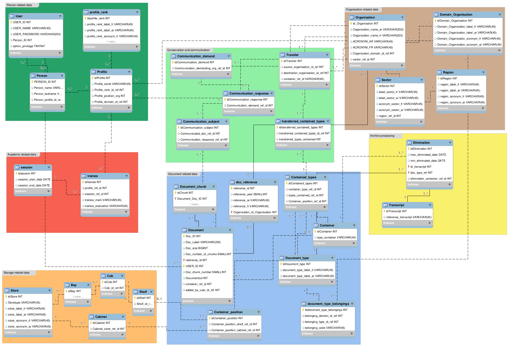

# Siman cloud based file management system 

## Description:

siman is an Amazigh word meaning "two souls" as a sign of our parents, from where we came from; which inspired us the concept of legacy that is related in a certain way to documents that we store and manage which we may not need in our everyday life but still have undeniable importance.

## Configuration:
 
 - Each [3rd party software](3rd_party_software/)  contains .env files that hold the specific configuration needed to launch its containers.
 - The deployment specifications are specified in each tag in the [Makefile](Makefile).

## Deployment:

Execute the following command:

    make

## Schemas:

>   ## Note:
>   You have to install `docker` and `docker-compose`, if you want to deploy it in another cloud platform just migrate the configuration to your target config.
<!-- >   Scylla-db cluster's data is not persistent. -->
<!-- >   Forget not to add .env file for the database you're willing to launch, along side its docker-compose.yml file.  -->
